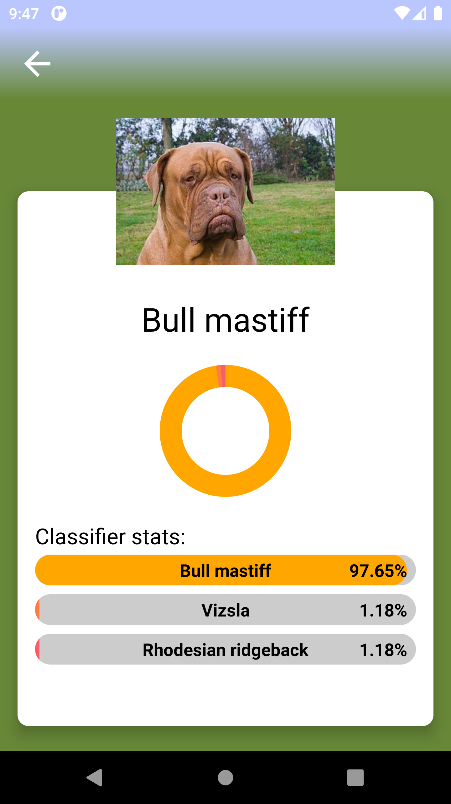
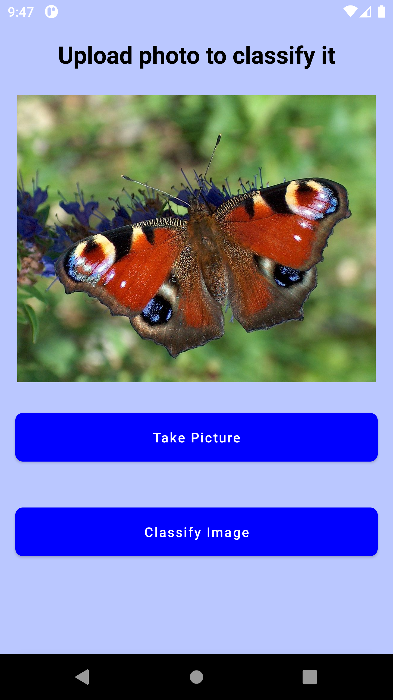
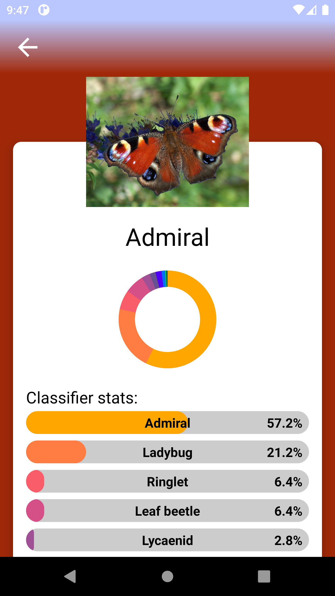
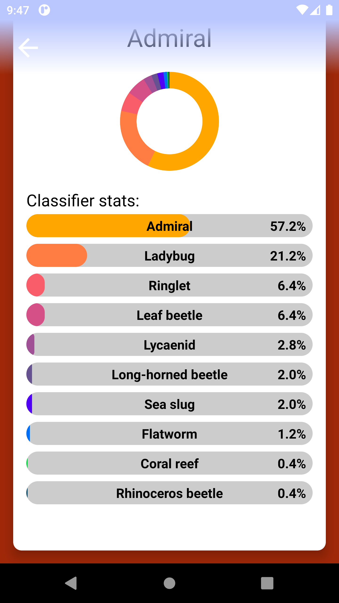
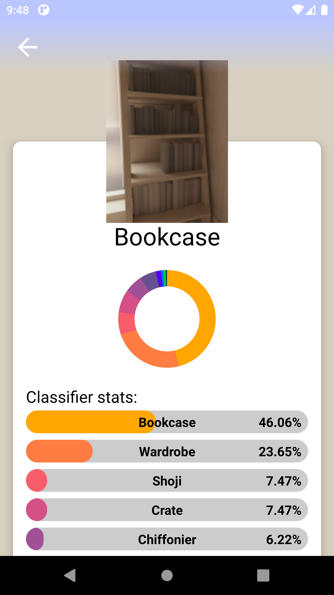
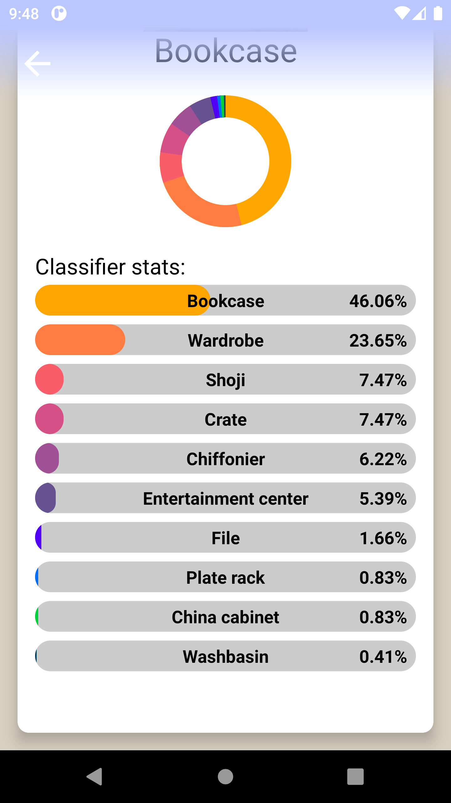
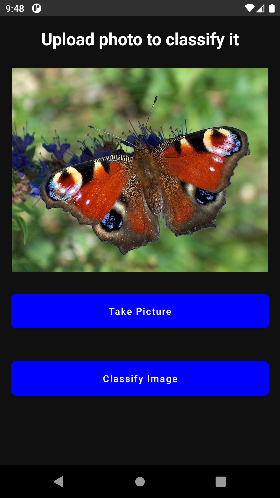
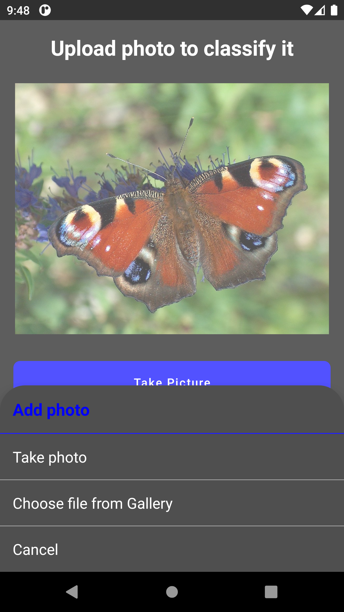
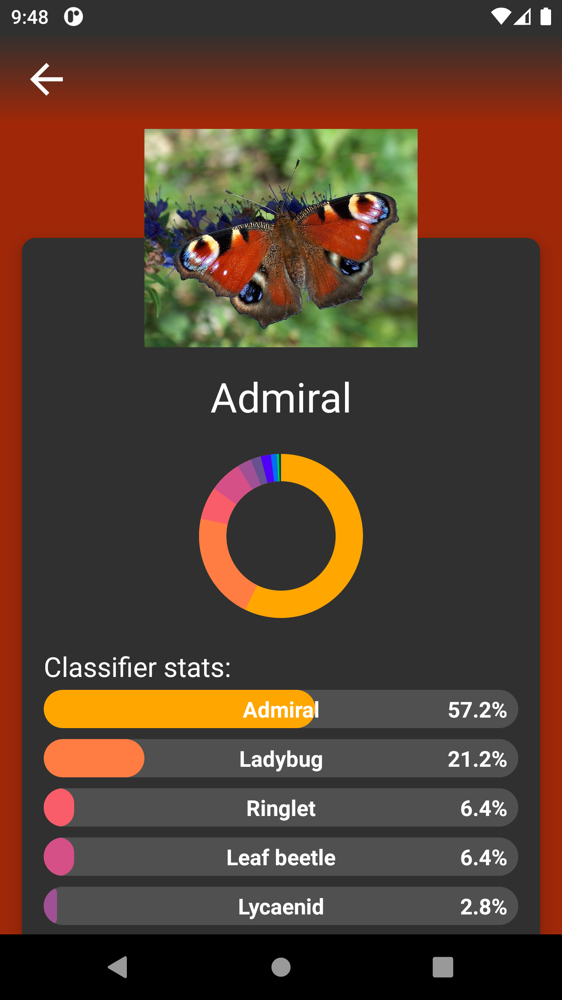
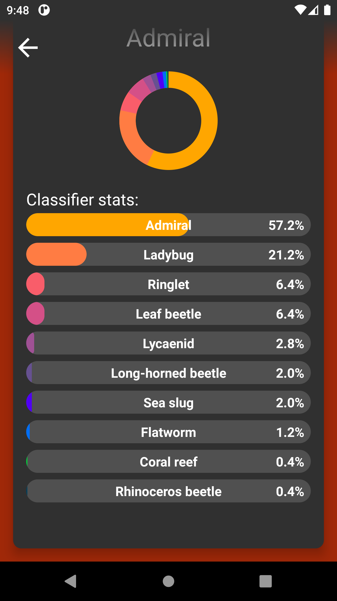

# JetML-ImageClassifier

This simple application was written with the main purpose of learning <b>Jetpack Compose, Tensorflow Light and Palette API</b>.  
JetML Image Classifier allows user to recognize what is in the photo using a machine learning model. A trained TensorFlow Light model was used.  
The photo can be selected both from the gallery and from the camera. The user is asked for permission to use the gallery or camera during runtime.    
<b>The background of the results is matched to the currently checked photo using Google Pallete API.</b>   

Additionally, thanks to the new possibilities of Jetpack Compose, animating bars and pie chart was a pleasure and the effect is very nice looking   

The application is written in mvvm architecture using dagger hilt as dependency injection, uses kotlin coroutines and works both in night and day mode depending on phone settings.  

Link to TensorFlow Light website: [TensorFlow Light](https://www.tensorflow.org/lite/android/quickstart)

## Table of contents:
* [Technologies](#technologies)
* [Illustrations](#illustrations)

## Technologies
Project is created with:
* Jetpack Compose
* Tensorflow Light
* Palette API
* Kotlin
* Kotlin Coroutines
* Android Studio
* Dagger - Hilt
* MVVM architecture

## Illustrations

 
 
 
 
 
 
 
 
 
 
 
 
 
 
 

